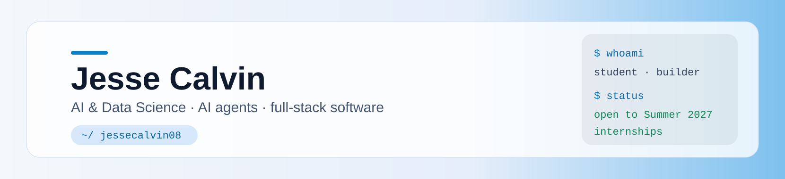
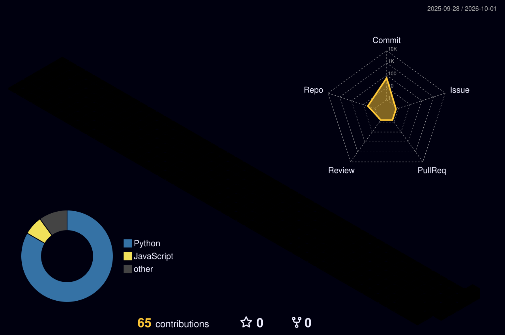

<picture>
  <source media="(prefers-color-scheme: dark)" srcset="art/header-dark.svg">
  
</picture>

<p align="center">
  <a href="https://instagram.com/jessecalvin08"></a>
  <a href="https://medium.com/@jessecalvin08"></a>
  <a href="https://x.com/jessecalvin08"></a>
  <a href="mailto:jessecalvin08@gmail.com"></a>
</p>

## `~/ whoami`

```console
jessecalvin08@github:~$ cat about.txt
```

- 🎓 First-year B.Tech in Artificial Intelligence &amp; Data Science at Amity University, Noida (2026–2030)
- 🛠️ I turn operational work into dependable software for a dental clinic, a 15-person media team, and a pharmaceutical supplier serving 100+ pharmacies
- 🔭 Currently working on AI agents, voice interfaces and a staged media production workflow
- 🌱 Currently learning local LLMs, agent workflows and safety testing for coding agents
- 👯 Looking to collaborate on AI automation and full-stack projects
- 💬 Ask me about React, Node.js, Python and building software for real teams
- 🎯 Seeking a **Summer 2027 internship** in AI automation or full-stack development

## `~/ projects --selected`

| Project | What I built | Stack |
|---|---|---|
| **[Jarvis](https://github.com/jessecalvin08/jarvis)** | Offline-first desktop voice assistant with on-device transcription, local TTS, a streaming React HUD, and swappable local reasoning | TypeScript · Node.js · React · Ollama · whisper.cpp |
| **[rulebranch](https://github.com/jessecalvin08/rulebranch)** | Bounded safety-testing harness for coding agents on Nebius Token Factory | Python |
| **[J's TAB](https://github.com/jessecalvin08/js-tab)** | Glassmorphism Chrome new-tab workspace built as a Manifest V3 extension | React · Vite · JavaScript |

> Some client systems remain private to protect their users and operational data. Demos are available on request.

- **AI Dental Appointment Agent**: takes patients from chat to a confirmed Google Calendar booking with live availability checks and conversational memory.
- **Media Workflow System**: supports availability, rosters and equipment inventory for a 15-person church media team; now expanding into a staged production workflow.
- **Pharmacy Bulk Ordering &amp; Inventory System**: supports catalogue browsing, requirements, and controlled stock and vendor administration for a pharma supplier.

## `~/ stack`

     
      
    

**Also working with:** n8n · Railway · REST APIs · WebSockets · authentication · role-based access control

<details>
<summary><b>Exploring / picking up</b></summary>

             

</details>

## `~/ the numbers`

<p align="center">
  
  
</p>
<p align="center">
  
</p>

## `~/ contributions --3d`

<p align="center">
  
</p>

## `~/ trophies`

<p align="center">
  
</p>

---

<p align="center"><i>Open to Summer 2027 internships. Email is the fastest way to reach me.</i></p>

<p align="center">
  <a href="https://visitcount.itsvg.in"></a>
</p>

<!-- Proudly created with GPRM ( https://gprm.itsvg.in ) -->
